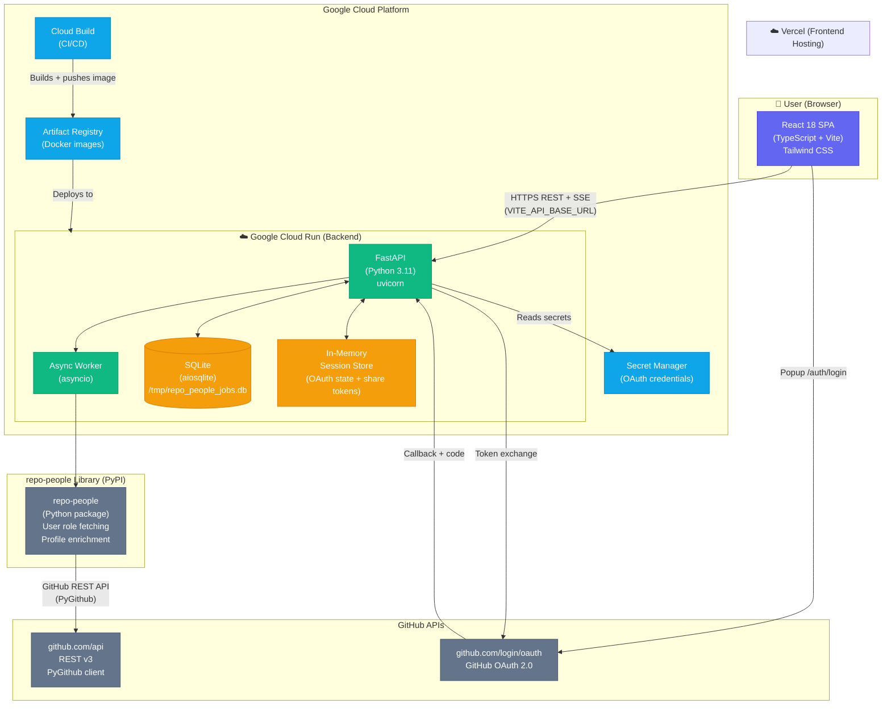

# repo-people App — Architecture Diagram



## Component Summary

| Layer | Technology | Purpose |
|---|---|---|
| **Frontend** | React 18, TypeScript, Vite, Tailwind CSS | SPA UI — fetch, results, compare views |
| **Tables** | TanStack Table v8 | Sortable/filterable user data table |
| **Charts** | Recharts | Role distribution, account age, leaderboards |
| **Maps** | react-simple-maps | Geographic contributor world map |
| **Exports** | jsPDF, html2canvas, xlsx | PDF/CSV/JSON export |
| **Backend** | FastAPI, Python 3.11 | REST API + SSE streaming |
| **Job worker** | asyncio | Non-blocking parallel GitHub fetching |
| **GitHub client** | PyGithub, httpx | Role fetching, OAuth token exchange |
| **Data library** | repo-people (PyPI) | User profile enrichment and role logic |
| **Database** | SQLite (aiosqlite) | Job persistence, session storage |
| **Auth** | GitHub OAuth 2.0 | Sign-in — session cookies |
| **Frontend host** | Vercel | Static build CDN delivery |
| **Backend host** | Google Cloud Run | Containerised serverless backend |
| **Container** | Docker (python:3.11-slim) | Portable backend runtime |
| **CI/CD** | Google Cloud Build | Build, test, push, deploy pipeline |
| **Secrets** | GCP Secret Manager | OAuth client ID and secret |
| **Image registry** | GCP Artifact Registry | Versioned Docker images |
| **Testing (FE)** | Vitest, Testing Library | Unit and component tests |
| **Testing (BE)** | pytest + httpx | API integration tests |
```
